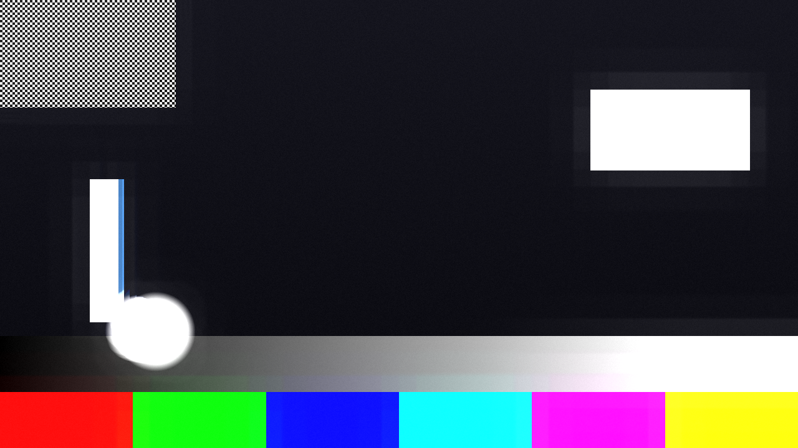
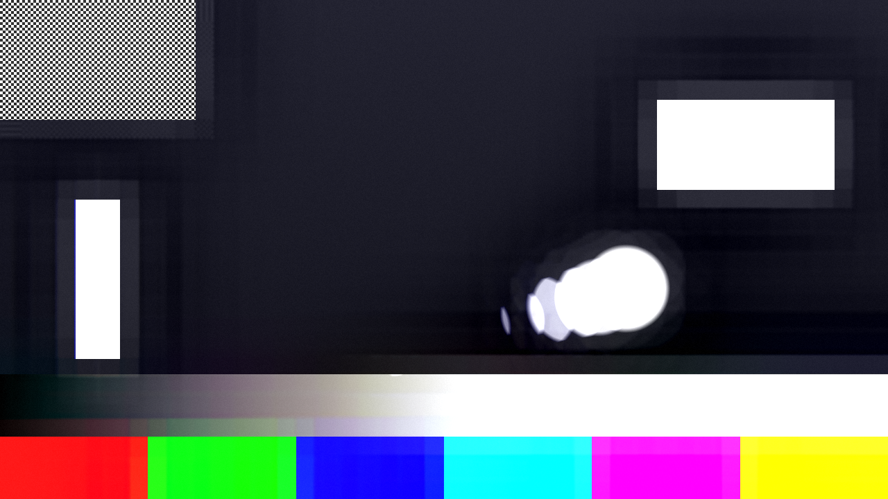

# plumbicon

> **AI-assisted project.** This codebase was created with [Claude](https://claude.com/claude-code)
> (Anthropic), directed and reviewed by a human author. The model is GPU-only
> and has no C++ mirror, so the central claim is not asserted but measured:
> `pbtest` drives the real plugin class headlessly and compares what comes back
> against closed forms — a highlight switched off against the exact discharge
> recursion, the tail behind a moving one against `v × fields` pixels, a
> tenfold and a hundredfold over-exposure against each other bit for bit, the
> burn accumulator against both of its poles over 700 fields. Every one of
> those runs at two rasters and fails if they disagree, and every tolerance is
> derived from the arithmetic or from the GLSL specification rather than from
> what this GPU printed first (see [Status](#status)). It has **never been
> loaded into Resolume on macOS**; see [Status](#status) for Windows.

A camera tube, as an FFGL effect for [Resolume](https://resolume.com) Arena and
Avenue. Not a filter that adds smear and bloom — a **photoconductive target
that stores charge**, and an electron beam that reads it by discharging it.



<sub>The repo's test card through the plugin at its defaults. The tail behind
the disc, the blue trailing edge on the bar, the white plate with no detail in
it and the faint rectangle etched around it are not four effects — they are one
store of charge, seen from four angles. Rendered by `pbtest`, the offline
harness, not captured from Resolume.</sub>

## This is the camera, not the screen

Nothing here models a display. There is no phosphor, no ghosting, no vertical
hold, no dot crawl, no shadow mask, no scanline and no tracking error. Those
all belong to [old-cathode](https://github.com/stoatworks-labs/old-cathode),
which is a sibling rather than a competitor: put **plumbicon** on the layer and
**old-cathode** after it and you have the whole chain, camera then monitor.

Said plainly because it is easy to assume otherwise: if you want the picture to
look like it is *on* an old television, that is the other plugin. This one is
what the picture looked like on its way *into* one.

## The one idea

A camera tube's target stores charge. Light charges it; the beam reads it by
taking the charge away; **the beam can only take so much per pass.** One
sentence, one function, about fifteen lines of GLSL. Everything the tube is
famous for is what is left over:

- **Lag.** A highlight that charged the target harder than the beam can
  discharge is still there on the next field, so it is read out again.
- **A comet tail.** That residue sits at *every point the highlight has passed
  over*, and a moving highlight has passed over a line of them. **Nothing draws
  a tail.**
- **Blocked highlights.** The target saturates. Past that, more light is not
  more charge, so the detail inside a highlight is never stored and cannot be
  read back.
- **Burn-in.** A second, far slower accumulator biases the local sensitivity
  down where the target has been bright, and recovers on a slower pole than it
  rose on — because a tube etches faster than it recovers.

Three more things fall out that were not aimed at. **A smear changes colour**,
because the store is per channel: a bluish highlight lags in blue and not in
red. **Two Fields doubles the tail**, because the beam visits a line every
other field and it therefore holds its residue twice as long. And **Two Fields
twitters on motion, and only on motion** — a moving edge is caught at two
different positions on alternate lines, because those lines were last read one
field apart, while a static area has no line structure at all. Nothing in the
code has an opinion about lines except the parity test.

The discipline is the point. If an artefact needs a term of its own to appear,
the mechanism has been lost somewhere. There is exactly **one** bolted-on term
in this plugin — the Image Orthicon's black halo, which is a different physical
mechanism entirely — and it is flagged as such everywhere it appears, including
in [AGENTS.md](AGENTS.md).



<sub>`Type = Image Orthicon`. The dark ring around the disc, the plate and the
bar is the halo, and it is the one thing here that is drawn rather than
derived — an Image Orthicon's halo is redistribution of secondary electrons
knocked off the target, and nothing in a charge store can produce it.</sub>

## Be honest about the input

**A real comet tail comes from something a hundred times brighter than peak
white** — a lamp in shot, a sun glint, a welding arc. A clip has no such thing:
everything above white was thrown away before this plugin ever saw it.

So `Sensitivity` is the exposure control that pushes the clip's own highlights
past the point where the beam can keep up, and that costs some headroom in the
midtones. There is no setting that gives a comet tail on a correctly exposed
8-bit picture, because there is nothing in one for the tail to come from. The
defaults are a slightly over-exposed plumbicon for that reason.

Two numbers are worth knowing, because between them they are the whole
instrument:

- **`Target Capacity ÷ Beam Current` is the length of the tail**, in fields.
- **`Beam Current ÷ Sensitivity` is the light level at which the target starts
  blocking up.**

They are independent, which is why both controls exist.

## Controls

| Group | |
| --- | --- |
| **Tube** | Type, Sensitivity, Target Capacity, Beam Current, Transfer Gamma, Dark Current. |
| **Lag** | Lag Amount, Recovery, Field Mode (Frame / Two Fields). |
| **Burn** | Burn Rate, Burn Recovery, Burn Depth. |
| **Optics** | Halation, Halation Radius, Bloom Threshold, Halo. |
| **Output** | Monochrome, Noise, Mix. |

**`Type` pins eight of them.** Plumbicon, Vidicon, Saticon and Image Orthicon
are the same model with different constants, and while one is selected the
Transfer Gamma, Dark Current, Target Capacity, Lag Amount, Burn and Halo
sliders are **inert** — they show a value and do not change the picture. Set
`Type = Custom` to drive them yourself; Custom starts from the Plumbicon row,
so switching to it changes nothing until you move a slider. Sensitivity and
Beam Current are always live, because those are how a camera is lined up on
the day rather than what the tube is made of.

**Time is measured in fields, and a field is a rendered frame.** Lag is a field
figure in every tube data sheet — a 50 Hz and a 60 Hz tube with the same
third-field lag behave identically per field — so the model counts fields and
never reads a clock. The consequence is that the look depends on your
composition's frame rate. So does a real camera.

**A Transfer Gamma below 1.0 lifts the picture.** A vidicon's really is about
0.65, and a real chain hands that signal to a display that re-applies about
2.2. This plugin is the camera; it does not correct for a display it does not
model. That is what the Vidicon type looks like on its own, and it is why
old-cathode exists.

## Status

**v0.1.0, built 2026-09-22 and released 2026-09-23, and
honestly early.** Verified by measurement on an M4 Max, macOS 26.4. Never
loaded into Resolume on macOS. On Windows it has: a CI build of the v0.1.0 source went through the fleet's Arena gate on 2026-09-23 (Resolume Arena 7.27.1 on win-lab, Mesa llvmpipe, no GPU). It loads from Extra Effects, registers as `SW Plumbicon` / `PB01` / effect, all 25 host parameters (Arena's Opacity plus these 24) match the declaration in name, order, type, range and default, it renders, and Arena's log stays clean. 18 of the 20 controls the gate probes measurably moved the picture; **Recovery and Burn Rate read as dead**, because the gate holds a still picture for about a second after each change and those two only act on motion and over many fields — the harness sweep proves both live over 40 and 90 fields. That is the gate's blind spot, not the plugin's. It says nothing about speed or a real GPU.

User guide: [docs/USER-GUIDE.md](docs/USER-GUIDE.md), also at
https://stoatworks-labs.com/software/plumbicon/guide/

| Check | Result |
| --- | --- |
| Discharge recursion | a saturated highlight switched off reads **1.000, 1.000, 1.000, 1.000, 0.277, 0.000** over six fields against a predicted 1.000 ×4, 0.2769813, 0.000 — four fields flat, one partial, then **exactly** zero. Linear, not exponential, and it stops dead |
| Two Fields | the tail runs **12 fields against 6**, and adjacent rows follow the alternating recursion to 2.6e-7 |
| Comet tail | a 64 px highlight at 4 px/field leaves **16 px** against 16 predicted, at 320×64 and 1280×128 |
| Target saturation | patches at **10×** and **100×** capacity both read `0.115470044` — the same bits — and that is `capacity × gain` exactly |
| Burn | tracks the closed form to **2e-7** over 400 fields of rise at six sample points, and to 2e-7 after 300 fields of recovery |
| Pass-through | a beam above capacity is the identity to **5.96e-8**, against an 8e-6 tolerance derived from the GLSL spec's accuracy for `pow`. Alpha is bitwise |
| No dead controls | all **19** swept parameters measurably change the picture |
| Shaders | all **6** compile through `glslc`, including the four assembled at run time that exist in no file |
| In an FFGL host | `oxbow` instantiates it and renders **120 frames, gl error 0x0, PASS** — `SW Plumbicon` / `PB01` / `effect`, 24 parameters in six groups (23 before the About block gained its User guide entry; re-run 2026-09-23) |
| macOS binary | universal (`x86_64 arm64`), exports `plugMain`, the plist is right, and it ad-hoc signs |
| Render cost | 0.60–0.64 ms/frame at 720p, 1.20–1.30 at 1080p, 4.50–4.63 at 4K |

**The memory is the headline, not the time.** The target is two picture-sized
**RGBA32F** buffers: 28 MB at 720p, 63 MB at 1080p, and **253 MB at 4K**.
`Field Mode = Two Fields` doubles it. 32F is not caution — the burn accumulator
moves by 1e-5 of its range per field, an order of magnitude below a half
float's epsilon at 1.0, so in 16F it would simply never start. Stack this on
four 4K layers and you will notice.

**Not done:** never loaded into Resolume on macOS; the universal build has
never run on an Intel Mac; no OpenFX port, no browser demo and no video. The
Windows x64 DLL is compiled with MSVC by `release.yml` on GitHub. The
tube-type constants are judged rather than taken off a data sheet, the burn
time constants are faster than a real tube's so the effect can be shown in a
take, and the halation is two Gaussians rather than a measured point-spread
function. `Field Mode` models the scan cadence, not an interlaced signal — the
output is progressive, and interlace *on a display* is deliberately
old-cathode's. CI (`ci.yml`, on GitHub's macOS runner) builds the plugin,
compiles every shader and runs the five physics checks on a GPU-less runner's software renderer — the first run there
caught a tolerance this Mac's GPU had hidden; `tools/verify.sh` on a machine
with a GPU is the full gate. See
[AGENTS.md](AGENTS.md) for the full list of what is assumed rather than
measured, for the traps, and for a line-by-line account of where every
tolerance in the harness comes from.

## Build

Needs CMake 3.15+, a C++17 compiler, and the FFGL SDK submodule.

```bash
git clone --recursive https://github.com/stoatworks-labs/plumbicon
cd plumbicon
cmake -B build -DCMAKE_BUILD_TYPE=Release
cmake --build build
cmake --install build    # → ~/Documents/Resolume Arena/Extra Effects
```

macOS builds universal (arm64 + x86_64) by default. Add
`-DCMAKE_OSX_ARCHITECTURES=arm64` for a faster development build.

## Building and testing

The offline harness drives the real plugin class in a headless GL context.
Every check needs a GPU, because the model is a fragment shader.

    ./build/pbtest --out /tmp/frame.png     the test card, through the tube
    ./build/pbtest --lag                    a highlight switched off
    ./build/pbtest --comet                  the tail behind a moving one
    ./build/pbtest --capacity               the target saturates
    ./build/pbtest --burn                   both poles of the accumulator
    ./build/pbtest --passthrough            a beam above capacity is the identity
    ./build/pbtest --bench                  720p, 1080p and 4K
    python3 tools/sweep.py                  no control is silently dead
    tools/verify.sh                         all of it, plus a real host load

## Licence

MIT — see [LICENSE](LICENSE).

<!-- attributions:start -->
This project is built on other people's work — see [ATTRIBUTIONS.md](ATTRIBUTIONS.md).
<!-- attributions:end -->
